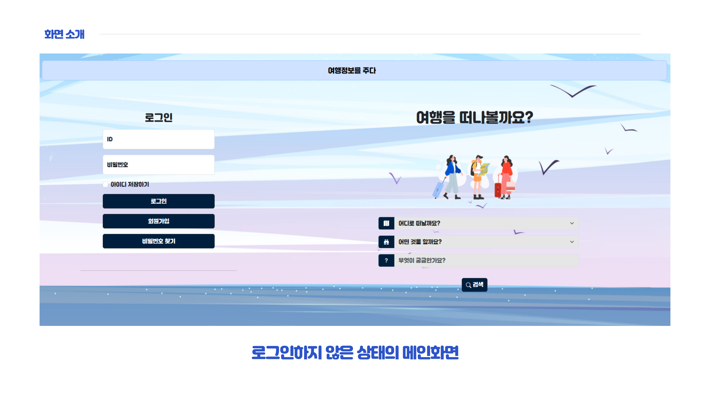
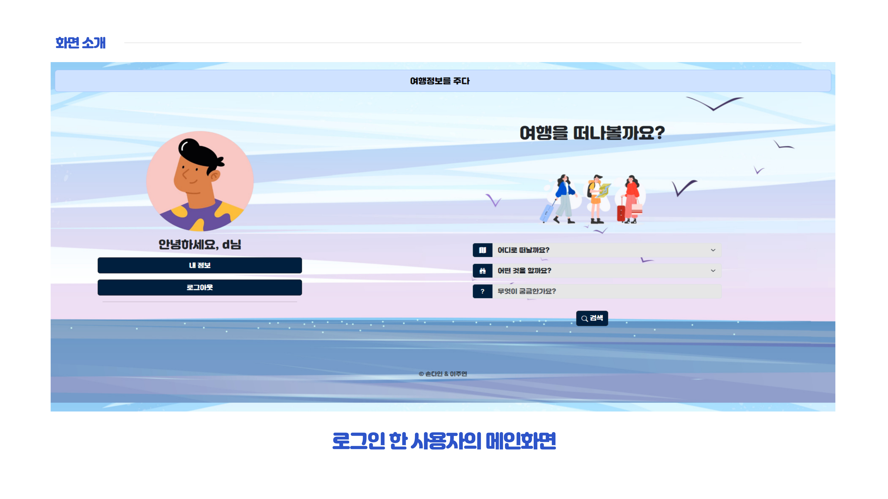
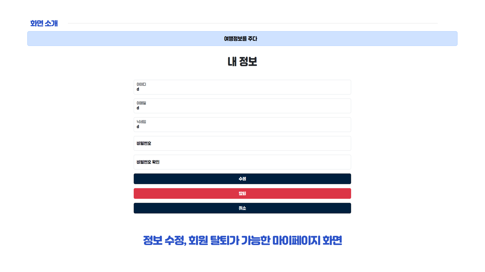
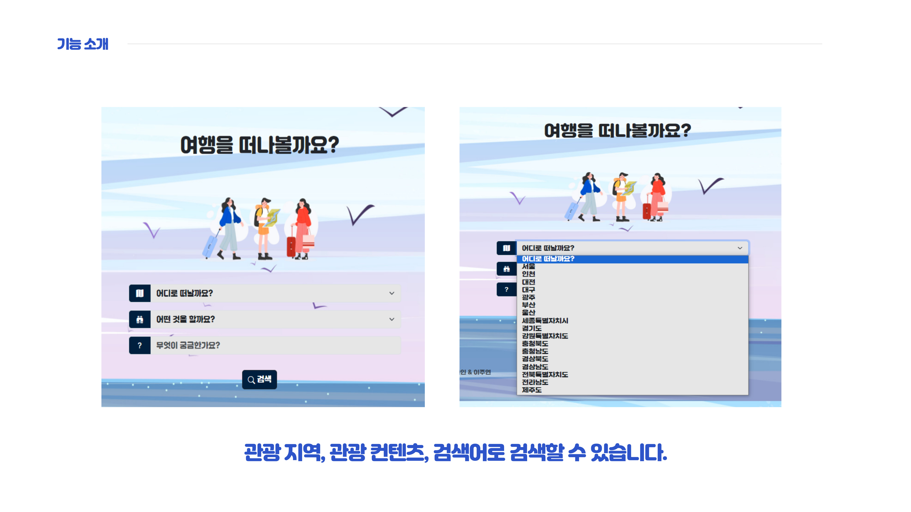
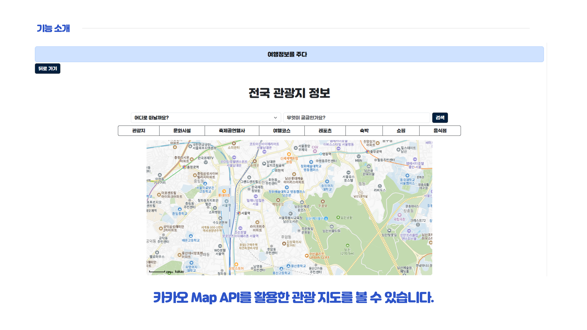
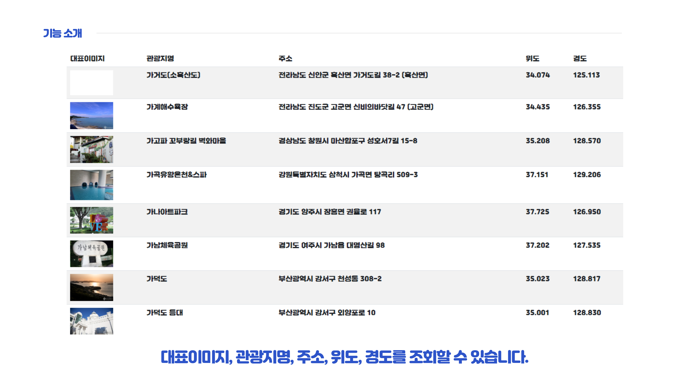

# 여행정보를 주다
---
Enjoy Trip!

### 💻 프로젝트 소개
SSAFY 1학기에 진행된 관통 프로젝트로, 사용자가 쉽게 국내 여행 정보를 검색할 수 있는 웹 사이트입니다.

---
### 🕐 개발 환경
- 2024.03.15 ~ 2024.03.15
- HTML  / CSS / Java Script / Bootstrap
## 📝 Features
###### 기본 기능
- [공공데이터포털의 한국 관광공사, 국문 관광정보](https://www.data.go.kr/tcs/dss/selectApiDataDetailView.do?publicDataPk=15101578)를 활용하였습니다.
- 회원가입, 로그인, 로그아웃, 정보수정이 가능합니다.

- 관광지역, 관광컨텐츠, 검색어로 검색할 수 있습니다.

- 카카오 Map API를 활용한 관광 지도를 볼 수 있습니다.

---
### 🏃 Members
- 👨 이주연
- 👩 손다인
